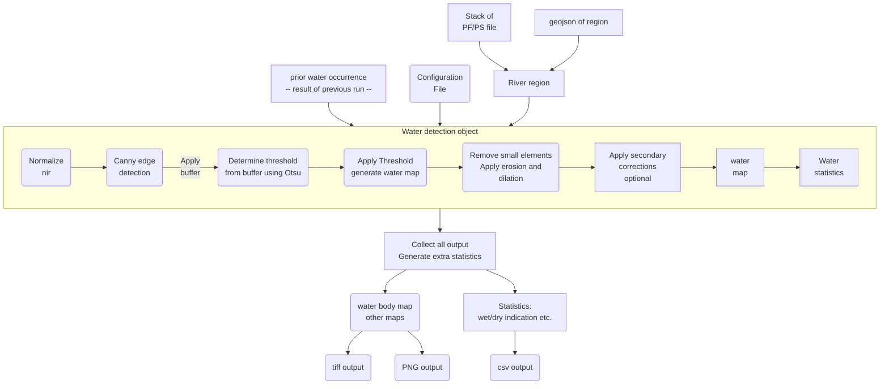

# DrySpy

This package can be used to detect open water from multi band optical satellite images and in a second step determine if a river runs dry. The water detection part can be used without the second part. It been tested with Sentinel-2, PlanetScope and PlanetFusion data.

1. The main class that does the open water detection of a single image is `co_water_detect.canny_otsu_water_detect`. The class is very generic and can be used for single images or with priori information in time series processing. It has been tested with Sentinel-2, PlanetScope and Planet Fusion data. The algorithm is based on the work of Donchyts et.al. 2016.
2. The `runner.py` file is a wrapper around the water detection class to perform river monitoring and detection of dry periods. If you install the `DrySpy` package (using pip) this wrapper will be installed as the `DrySpy` command-line program. This is a very specific runner, it is suggested _to write you own for most applications_.
3. The `rw_utils.py` file contains simple (draft) readers for Planet Fusion and PlanetScope and Sentinel-2 data and are used in the `runner.py` command line wrapper. These assume the data originate from a specific source (e.g. Sentinel-hub in case of the S2 data). 


## Installation

Starting from the dryspy folder:

- Setup the environment using conda: `conda env create -f env-dryspy.yml`
- activate the environment: ` conda activate dryspy`
- install the package: `pip install .`

If you want to use the jupyter notebook examples you will need to manually install the jupyter package (`conda install jupyter`).

## Starting

A simple example of using the `co_water_detect.canny_otsu_water_detect` class can be found in `notebooks/example/example-waterdetect.ipynb`. This example loads the class and some sentinel-2 data and performs water detection on nir and swir bands with different settings. 


## DrySpy

The `DrySpy` command can be used to loop over a stack (in time) of Planet Fusion images, detect water for each day and summarize the results. In addition, it tries to detect dry periods. It is a very specific piece of software that needs to be adjusted for other use cases. It may be easier to write your own wrapper/runner. 

```
 Usage: DrySpy [OPTIONS]

 Run the DrySpy program. Detect water in regions and calculate statistics

╭─ Options ──────────────────────────────────────────────────────────────────────────────────────────────────────╮
│ --input_folder                 TEXT  input folder with planetscope data (PS, UDM and XML), FUSION (PF)  or     │
|                                      Sentinel-2 (S2) data                                                      │
│ --prior_water_occurrence       TEXT  input file (1 band tiff (0-1)) of prior water occurence                   │
│ --clip_file                    TEXT  geojson file used to clip the input files                                 │
│ --file_type                    TEXT  type of input files: PS | PF                                              │
│ --output_folder                TEXT  output folder, will be created if not present                             │
│ --tmp_folder                   TEXT  scratch folder                                                            │
│ --save_overview_pngs      -sp        Save an overview png for each date.                                       │
│ --save_tiff_results       -st        Save geotif results for each date.                                        │
│ --config_file                  TEXT  Config file, default is dryspy.ini                                      │
│ --startdate                    TEXT  only process file after this date                                         │
│ --enddate                      TEXT  only process file before this date                                        │
│ --help                               Show this message and exit.                                               │
╰────────────────────────────────────────────────────────────────────────────────────────────────────────────────╯

```

The graph below summarizes the steps taken by the `DrySpy` command.



In the `notebooks/example` folder you can also find the `cli_run_s2.sh` script that runs the command line tool using the Sentinel-2 files in the `notebooks/example/EO_Browser_images/Scott-River` folder.

## Output

The `stats` dictionary (save as a csv after a run) contains the following parameters:

hist_kurtosis
  : kurtosis of the data used in the water detection after scaling

hist_skew
 : skewness of the data used in the water detection after scaling

25
  : 25th percentile

75
  : 75th percentile

diptest
  : results of a diptest of unimodality (Hartigan and Hartigan, 1985) 

hist_slope
  : slope of the histogram at the water/land threshold

diff_in_out
  : difference between the value of the data inside and outside of the main channel (after Wang and Vivoni, 2022)

In addition, the following values for the first 20 (in size) detected water bodies:

wb_area_n
  : area in pixels

wb_mean_n
  : average value of the variable used in water detection in this area

wb_area_length_n
  : length of the longest axis of this area

wb_area_length_short_n
  : length of the shortest axis of this area

wb_area_label_n
  : label of this area

dry_nir_diff
  : dry periods as determined by the nir difference method (True|False)

dry_wb_length
  : dry periods as determined by water body length method (True|False)


## Dry vs running river detection

There are a number of parameters calculated for each timestep (and saves in the `.csv` file) that can be used to determine if the river is flowing or not.

1. The length of individual water bodies detected in the region is calculated and save in the `csv` file as `'wb_area_length_1` to n for each detected water body. We find that the sum of the three largest water bodies is a good measure to use.
2. Based on the work of Wang and Vivoni (2022) an index is calculated based on the value of the band/index used in the water detection inside and outside of the channel. 


## Configuration

``` ini
# Settings for the canny edge detection and otsu thresholding method
[edge_detection]
sigma = 2.5  
# A larger value smooths the image more before finding the edges

# For otsu
classes = 3  
# Number of classes in the otsu thresholding (the lowest class is used)
buffer = 2   
# Buffer to apply after the edge detection to increase the number of sampling points
histogram_scale_maxvalue = 25    
# scaling upper limit for the histogram stretching
histogram_scale_minvalue = 0
threshold_multiplication = 1.0   
# Scale factor to apply to threshold (should not be needed)

# Here we set the thresholds (or percentiles) for nir and ndwi for the water detection
[nir_and_ndwi]
#nir_th = 0.18
#ndwi_th = -0.5847580417346776
nir_th_perc = 5
ndwi_th_perc = 5

# final cleaning of the detected water map (delete small areas)
[data_clean]
min_size = 6 
# Minimum size of the detected elements. Smaller elements are removed
dilation_erosion_size = 6   
# Size of the dilation/erosion kernel used to clean the detected water elements
max_data_value = 0.80
min_data_value = -0.98
min_u_pixel = 0.10
min_u_area = 0.16
min_occur = 0.09
weight_of_prior = 365

[area]
clip_file = clip.geojson   
# should be in the same coordinates as the raster files

[dry_detection]  
# Used in the dryspy cli version only

# Difference in nir inside and outside of the channel
nir_diff_th = -0.05
# Number of water bodies to include in the length calculation
number_wb = 3 
```


## Setting up a new region to monitor

1. Make sure you have access to the PS/PF/S2 data for that region. This will in most cases be a (cloud)storage location holding the data of a subscription
2. Make a geojson (qgis works good for that) of the stretch of river you want to monitor using the same georeferencing as the tiff files with the data. Make sure the area is chosen such that the open water (river) will _not_ cover the majority of the area but is a significant proportion of the area. Try and avoid shadow's and very dark vegetation
3. Copy the example configuration file, give it a new name and edit the values if needed
4. Test running with a single file (timestep) and adjust parameters if required


## References

Donchyts, G., Schellekens, J., Winsemius, H., Eisemann, E., Van de Giesen, N., 2016. A 30 m resolution surface water mask including estimation of positional and thematic differences using landsat 8, srtm and openstreetmap: a case study in the Murray-Darling Basin, Australia. Remote Sensing 8, 386.

J. A. Hartigan. P. M. Hartigan. "The Dip Test of Unimodality." Ann. Statist. 13 (1) 70 - 84, March, 1985. https://doi.org/10.1214/aos/1176346577

Wang, Z., Vivoni, E.R., 2022. Detecting Streamflow in Dryland Rivers Using CubeSats. Geophysical Research Letters 49, e2022GL098729. https://doi.org/10.1029/2022GL098729
